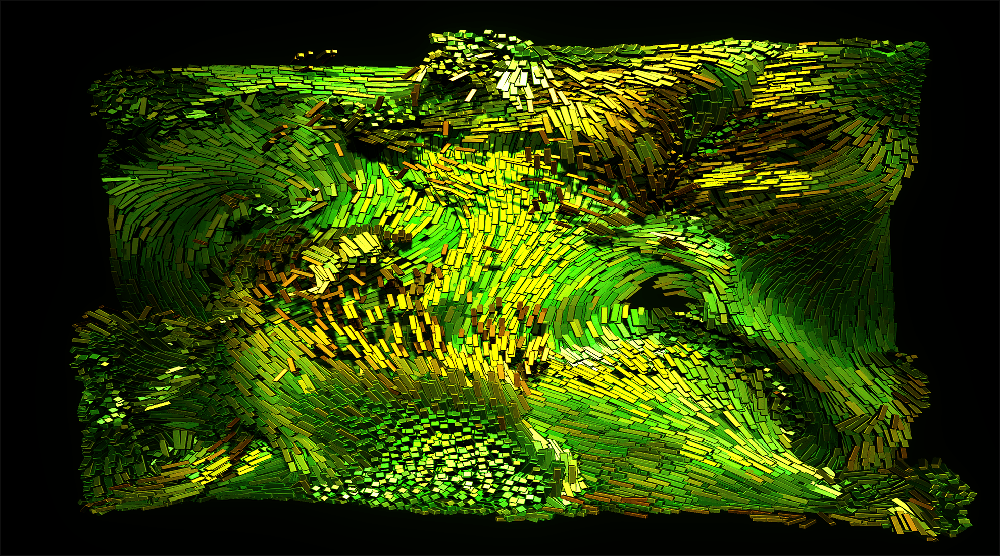
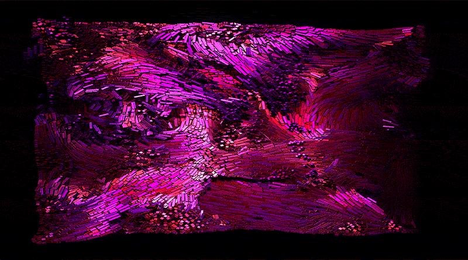

# Flow Lab

Flow Lab is a browser-based WebGPU particle-simulation project built with Three.js TSL.

It explores realtime MLS-MPM motion with a fluid-art visual direction, plus interactive scene controls and built-in capture tools for stills and short loops.

<!-- workspace-hub:cover:start -->
[](https://proto.lucidity.design/sites/flow-lab)
<!-- workspace-hub:cover:end -->

## Demo

[https://proto.lucidity.design/sites/flow-lab](https://proto.lucidity.design/sites/flow-lab)




## Controls

- orbit with pointer drag
- press `Space` to pause or resume the simulation
- use the Tweakpane `settings` panel for particle count, particle size, bloom, and point rendering
- use `settings > presentation > fitToWindow` to make the viewport aspect become the active chamber, so the simulation fills the window instead of staying in the original contained box
- use `settings > presentation > showChamber` to toggle the chamber mesh in either mode
- use `settings > background` to switch between HDR sky and a solid background color, and to tune chamber surface settings
- use `settings > color` for quick palette presets and manual hue / saturation / value tuning
- use `settings > capture` to save a PNG or a short GIF from the current viewport, and reduce GIF size with scale, frame count, and fps
- tune `settings > presentation > exposure`, `environmentIntensity`, and `bloomStrength` for different looks

## How to run

From the repo root:
```
npm install
npm run dev
```

## Notes

- WebGPU support is required for the intended rendering path
- this repo is configured for direct local runtime in Codex Workspace via [.workspace/project.json](.workspace/project.json)

## Reference

Reference chain:

- the MLS-MPM implementation is heavily based on [matsuoka-601/WebGPU-Ocean](https://github.com/matsuoka-601/WebGPU-Ocean)
- the visual direction is influenced by [Refik Anadol](https://refikanadol.com/)
